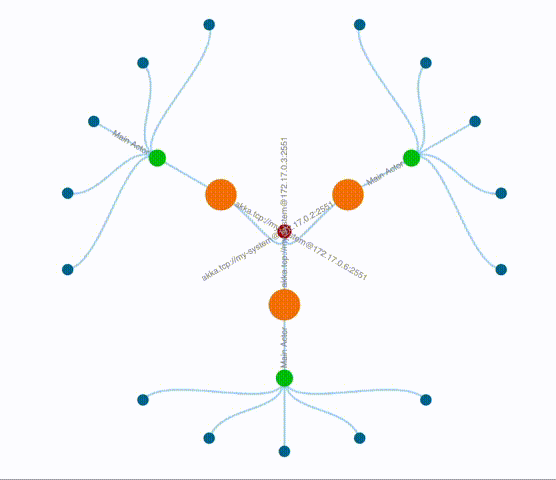

# Akka Cluster Visualizer



### Setup

To use the Akka cluster Visualizer in your project you must build this project locally and run

```
sbt publishLocal
```


To setup the akka cluster visualizer all you need to do is first create the Tree Actor.  The Tree actor will keep track 
of the structure of your actors and also expose the UI to your browser.

```
val treeActor = system.actorOf(TreeModelActor.props(true, 8080), "tree-actor")
```

Second you need to register and unregister the actors you want to have displayed in the tree

```
  override def preStart(): Unit = {
    TreeModelActor ! RegisterActor("Main Actor", "user", self.path.name, "Main Actor", "shard")
  }
  
  override def postStop(): Unit = {
    TreeModelActor ! UnregisterActor(self.path.name)
  }
  
```

### Deploying the Sample App

```
minikube start --cpus 4 --memory 8192

eval $(minikube docker-env)

sbt docker:publishLocal

kubectl create namespace akkavis
kubectl --namespace akkavis apply -f rbac.yaml

kubectl apply --namespace akkavis -f local.yaml

kubectl port-forward --namespace akkavis svc/akkavis 8080:8080

kubectl delete service akkavis --namespace akkavis
kubectl delete deployment akkavis --namespace akkavis

sbt publishLocal
```